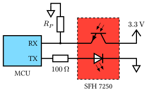
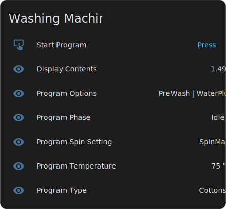

# FreeMDU Home

The FreeMDU home firmware provides a USB-UART bridge for Miele's optical diagnostic interface. It also features MQTT-based integration with Home Assistant.

## Getting started

To communicate with Miele devices via the diagnostic interface, a suitable optical communication adapter is required. The adapter consists of a microcontroller and an [OSRAM Multi TOPLED SFH 7250](https://ams-osram.com/products/leds/multi-color-leds/osram-multi-topled-sfh-7250) infrared emitter and phototransistor.

The firmware currently supports only the Espressif **ESP32-C3** and **ESP32-C6** microcontrollers. Other targets are not yet supported. The transceiver is connected to the microcontroller according to the schematic below:



Because $R_P$ determines the phototransistor's sensitivity, an appropriate resistance must be selected. In most cases, a value of approximately $`47\,\text{k}\Omega`$ works well.

By default, the firmware uses the `UART1` peripheral for infrared communication, with pin `0` as RX and `1` as TX. Pin `10` can be connected to an active-low status LED or a WS2812 RGB LED (with `--features ws2812led` enabled). All pin assignments can be modified in the [`.cargo/config.toml`](.cargo/config.toml) file.

### Firmware modes

The firmware can be built in one of two modes depending on your use case. In **bridge mode**, the firmware simply forwards all data between the USB-UART connection and the infrared transceiver. This allows desktop tools, such as the [FreeMDU TUI](../tui), to communicate with the connected device for diagnostics or testing.

In **standalone mode**, the firmware connects to a Wi-Fi network and periodically publishes operational properties and actions from the connected Miele device via MQTT. This mode is intended for integration into home automation systems such as Home Assistant. No desktop connection is required, but the Wi-Fi and MQTT configuration must be specified in the [`.cargo/config.toml`](.cargo/config.toml) file before flashing the firmware.

### Flashing the firmware

1. Install the [`espflash`](https://github.com/esp-rs/espflash) tool:

```shell
cargo install espflash --locked
```

2. Use the following command to build and flash the firmware:

```shell
cargo run --features esp32c6 --target riscv32imac-unknown-none-elf --release --bin <MODE>
```

Replace `<MODE>` with the desired firmware mode (`bridge` or `standalone`). For the ESP32-C3, substitute `esp32c3` and `riscv32imc-unknown-none-elf`.

To enable support for WS2812 RGB LED, add a `--features ws2812led` argument. With this feature enabled, the LED will blink in red color in bridge mode during communication while in standalone mode it will turn green when connected. 

## Usage



In bridge mode, connect the microcontroller to your desktop computer via USB. It appears as a USB CDC device and can be used like a standard serial port. In standalone mode, the firmware automatically connects to the configured Wi-Fi network and publishes MQTT data at regular intervals. It supports Home Assistant's [MQTT discovery](https://www.home-assistant.io/integrations/mqtt/#mqtt-discovery) feature, which automatically creates entities without manual configuration. The available entities may vary depending on the properties and actions supported by the connected Miele device.

### Receiving properties

Device properties are published to MQTT topics in the following format:

```
freemdu_home/<DEV>/<PROP>/value
```

The `<DEV>` placeholder represents the device's hardware address and `<PROP>` is the property ID. For example:

```
freemdu_home/b43a45abcdef/program_options/value
```

### Triggering actions

Device actions are triggered by publishing values to MQTT topics with the following format:

```
freemdu_home/<DEV>/<ACTION>/trigger
```

The `<DEV>` placeholder represents the device's hardware address and `<ACTION>` is the action ID. For example:

```
freemdu_home/b43a45abcdef/start_program/trigger
```

Some actions require parameters, in which case the published value is used as the argument. Actions without parameters ignore the published value. Due to technical limitations, actions requiring parameters are currently not displayed in Home Assistant, but can still be triggered via MQTT.
