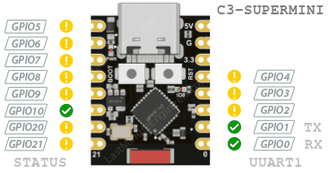

### Firmware modes (AUX)

Modified **standalone mode**. The core of the modification is that regardless of the configuration in [`.cargo/config.toml`](https://www.google.com/search?q=.cargo/config.toml), the MQTT server address will be the same as the DHCP server address, assuming that the MQTT service will run on it as well. For testing, an Android phone's Wi-Fi hotspot function can be used this way. HomeAssistant and the Mosquitto broker can be run under Termux; good solutions exist for these. Similarly, a Raspberry Pi (not tested) or an Orange Pi can also be suitable when properly configured. In this case, the essential parts of the cargo settings are WIFI_SSID and WIFI_PASSWORD. The MQTT_HOSTNAME does not matter. If Mosquitto allows anonymous usage, the following two lines are not essential either.

The **proximity** mode can help with testing the hardware connection. The state of the input pin (RX) is mirrored to the output status LED. The (TX) pin is enabled, so the operation of the infrared LED can be checked with a mobile phone camera (older phones were better at this, as the infrared spectrum was less filtered); in this case, the camera should be placed very close to the infrared light source (LED). The operation of the infrared phototransistor can be checked in two ways. One is if you have a remote control at hand. Pressing buttons on the remote control will cause the status LED to flicker, indicating signal reception. The other option is to bring a reflective surface close to the optical transceiver unit. At a distance of a few millimeters, the status LED switches off (goes dark), indicating the proximity of the surface.  
*Remember! The status LED gives an inverted signal, active low operation.*

### Firmware modes (AUX)

Módosított **standalone mode**. A módosítás lényege, hogy a beállítástól függetlenül [`.cargo/config.toml`](.cargo/config.toml) az MQTT szerver címe ugyanaz lesz, mint amelyik DHCP kiszolgáló címe, feltételezve, hogy azon fut majd az MQTT szolgáltatás is. Teszteléshez így alkalmazható egy Android telefon Wifi hotspot funkciója. A HomeAssistant és a Mosquitto broker Termux alatt futtatható, ezekre léteznek jó megoldások. Ugyanígy egy Raspberry (nem próbáltam) vagy egy OrangePi szintén alkalmas lehet megfelelően konfigurálva. A cargo beállításokból ilyenkor a lényeges rész az WIFI_SSID és a WIFI_PASSWORD. Az MQTT_HOSTNAME nem számít. Ha a Mosquitto engedi az anonim használatot, akkor a következő két sort sem lényeges

A **proximity** a hardwer összeköttetés teszteléséhez adhat segítséget. A bemeneti láb (RX) állapota másolódik a kimeneti státusz ledre. A (TX) láb bekapcsolva, így egy mobiltelefon kamerájával ellenőrizhető az infra led működése (a régebbi telefonok ebben jobbak voltak, kevésbé volt szűrve az infra tartomány), ilyenkor a kamerát jó közel kell tenni az infra fényforráshoz (led). A infra detektor tranzisztor működése kétféle módon ellenőrizhető. Az egyik ha kéznél van egy távirányító. A távirányító gombjait nyomogatva a státusz led villódzása mutatja a vételt. A másik lehetőség ha egy tükröződő felületet közelítünk az adó-vevő optikai egységhez. Néhány miliméter távolságban a státusz led átvált (sötét lesz), jelezve a felület közelségét.  
*Ne feledd! A státusz led invertált jelet ad, aktív alacsony szintű működés.*

