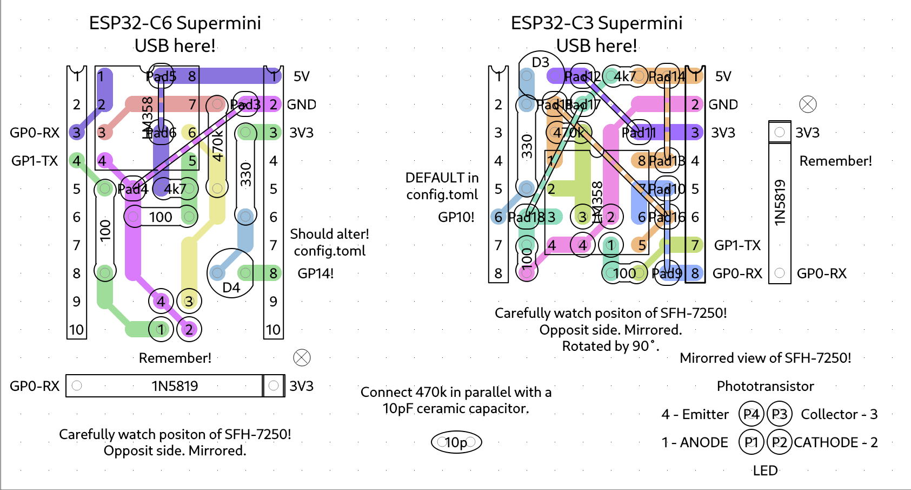
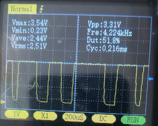
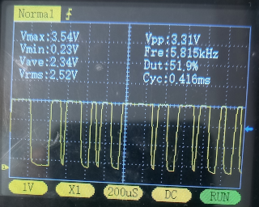
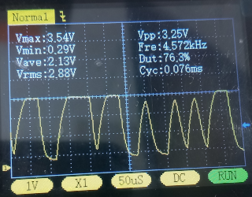

### VEROROUTE examples

**2026-AUG-28** - Some experiments

I fabricated two PCB prototypes using feedback configurations similar to the ones shown below: one with a 150 kΩ / 22 pF network, and the other with a 330 kΩ / 10 pF network.

Both boards were evaluated using the **checkforerror** firmware. Results indicate that the second configuration doubles the overall sensitivity while maintaining stability. It performed reliably regardless of sensor placement—whether positioned directly against the LED or set further back. I also monitored the input signal at the TX pin using an oscilloscope, and the signal integrity looked solid.

Instead of using fixed resistors to bias the op-amp's non-inverting input, I installed a 10 kΩ potentiometer. The measured calibration values are as follows:

```
First board (150 kΩ / 22 pF): 9.36 kΩ – 9.14 kΩ – 290

Second board (330 kΩ / 10 pF): 9.41 kΩ – 9.17 kΩ – 291
```

Based on these findings, the previously suggested 4.7 kΩ and 100 Ω resistor network does not appear to be optimal. 100 Ω replaced by 150 Ω looks better.

For benchmarking, a standard red LED (with series resistor) can be connected to the TX pin (GPIO-1) of an ESP32-C3 SuperMini running the **asciisending** firmware.

The next step will be to re-evaluate performance under real-world conditions on a washing machine.

[veroroute](https://sourceforge.net/projects/veroroute/)



It seems better to leave the capacitor ( 10 or 22 pF ) out of the circuit. 

  

At 38400 baud, the data still just about gets through. However, it is clear that at this speed, achieving error-free communication with this circuit is already difficult.


