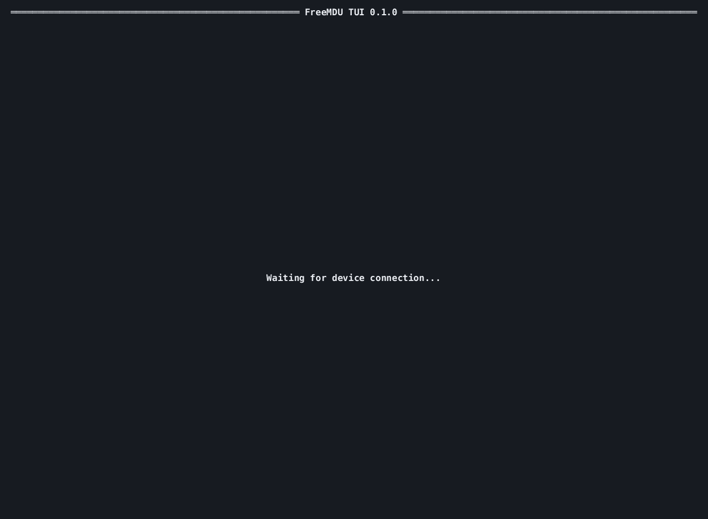

# FreeMDU TUI

<p align="center">
  
</p>

The FreeMDU terminal UI (TUI) is a simple command-line application for diagnosing and testing Miele devices via the optical diagnostic interface. It retrieves all diagnostic properties from a connected device and presents them in a clear, user-friendly format. The TUI also lists all supported device actions, which can be triggered directly from the terminal.

## Getting started

1. Download a pre-built release from [here](https://github.com/medusalix/FreeMDU/releases) or build the crate from source:

```shell
cargo build --release
```

2. Run the application:

```shell
./freemdu-tui /dev/ttyACM0
```

Replace `/dev/ttyACM0` with the serial port of your communication adapter.

## Usage

After starting the application, connect the communication adapter to your device. A connection will automatically be established if the device is supported. Once connected, the TUI displays the current diagnostic **properties** retrieved from the device. A list of available **actions** appears at the bottom of the terminal. The application can be quit by pressing `q` or `Ctrl+C`.

### Properties

Each supported device defines a set of diagnostic properties, grouped into the following categories:

- **General Information** (e.g. operating time)
- **Failure Information** (e.g. detergent overdose)
- **Operating State** (e.g. current program phase)
- **Input/Output State** (e.g. current water level)

Property values are periodically updated from the device. Sensor values, indicated by a line gauge, show both the *current* and *target* readings, separated by a slash.

### Actions

Device actions can be triggered using the function keys `F1` through `F10`. If the action requires a parameter, a value must be entered before pressing the `Enter` key.

## Troubleshooting

If the application behaves unexpectedly, trace logging can be enabled using the `RUST_LOG` environment variable:

```shell
RUST_LOG='freemdu=trace' ./freemdu-tui /dev/ttyACM0 2> log.txt
```

> [!NOTE]
> Standard error output cannot be displayed in the same terminal as the TUI. Redirect it to a file (e.g. `log.txt`) or use a separate terminal (e.g. `/dev/pts/2`) to view the logs.
